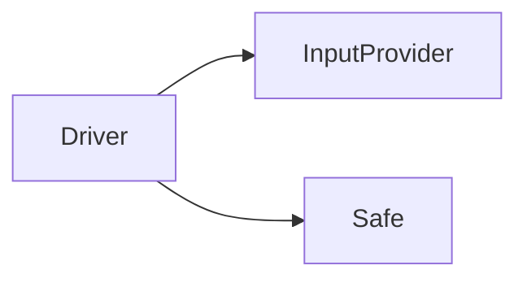

# Day 1

## Approach
Although this can be done with a simple few-liner,
Today I want to do this with a few components
and unit tests to aim to get the problem right the first time.

## Problem
* There's a safe
* The safe dial has 100 positions, 0-99
* There's an input sequence with instructions like L3 or R2
* For each instructions we move the dial left (lower numbers) or right (higher)
* We count how many times the dial landed on 0

## Components


## Running Tests
```
python -m unittest discover
```

