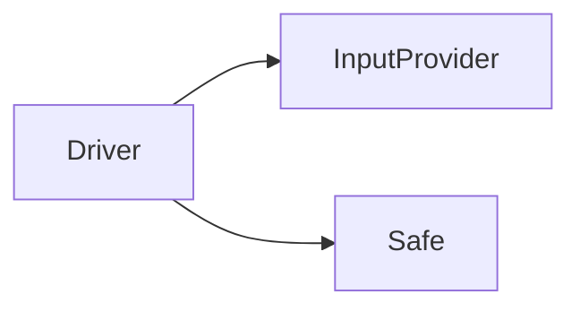

# Day 1

## Approach
Although this can be done with a simple few-liner,
Today I want to do this with a few components
and unit tests to aim to get the problem right the first time.

Advent of code, at least the first easy problem, is a fun way to practice red green refactor.
 
It's also a good illustration of why you might want to use test driven development.
 
Because when you do it this way, reflect on two things.
 
You'll notice your solution is way way bigger than just quickly writing a 3-liner.
 
But think about these two things:
1. If you were approaching the resulting code from the outside, and needed to change it, which would you rather see?
2. What are the chances with the yolo code that you'd get the right answer the first time, and be confident it was really and truly the right answer? No off by one errors, no little mistakes in how the IO works.

If you really wanted confidence that the code was right, you'd have to test it yourself by hand,
with tests that you throw away.
 

## Problem
* There's a safe
* The safe dial has 100 positions, 0-99
* There's an input sequence with instructions like L3 or R2
* For each instructions we move the dial left (lower numbers) or right (higher)
* We count how many times the dial landed on 0

## Components


## Running Tests
```
python -m unittest discover
```

## Running the problem
```
python day1.py
```